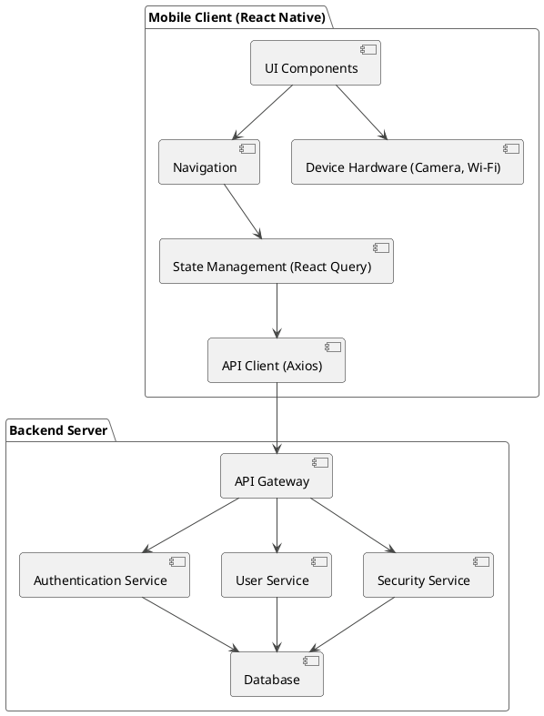

**High-Level Design (HLD)**

**1. Introduction**

This document provides a high-level design for the Mobile Cyber Security (MCS) application. It outlines the system architecture, major components, their interactions, and the overall technology stack.

**2. System Architecture**

The MCS application follows a classic client-server architecture.

*   **Client:** A mobile application built with React Native, supporting both Android and iOS platforms.
*   **Server:** A backend system that exposes a RESTful API for the client to consume.

**3. High-Level Architecture Diagram**

**4. Component Design**

**4.1. Client-Side Components**

*   **UI Components:** A collection of reusable React components responsible for rendering the user interface. This includes screens, buttons, charts, and other visual elements.
*   **Navigation:** The application uses React Navigation to manage the flow between different screens. It includes a stack navigator for the main application flow and a bottom tab navigator for the primary sections of the app.
*   **State Management:** The application utilizes Tanstack Query to manage the server state. This includes fetching, caching, and updating data from the backend API.
*   **API Client:** An Axios-based API client is used to make HTTP requests to the backend REST API. It handles request/response cycles, error handling, and authentication tokens.
*   **Device Hardware:** The application interacts with the device's hardware, specifically the camera for QR code scanning and the Wi-Fi module for network analysis.

**4.2. Server-Side Components**

*   **API Gateway:** The single entry point for all client requests. It routes requests to the appropriate backend service and can handle tasks like load balancing, authentication, and rate limiting.
*   **Authentication Service:** Manages user authentication and authorization. It handles user registration, login, email verification, and password management.
*   **User Service:** Responsible for managing user-related data, such as user profiles and account settings.
*   **Security Service:** This is the core of the backend and contains the business logic for the security features. This includes:
    *   URL scanning and domain reputation analysis.
    *   Data breach checking.
    *   Cyber news aggregation.
*   **Database:** A persistent storage system (e.g., a relational or NoSQL database) to store user data, application settings, and other relevant information.

**5. Data Flow**

1.  **User Interaction:** The user interacts with the UI components on the mobile client.
2.  **Navigation:** The navigation component directs the user to the appropriate screen based on their actions.
3.  **State Management:** When data is needed from the backend, the state management library (Tanstack Query) initiates a request.
4.  **API Client:** The API client sends an HTTP request to the backend API gateway.
5.  **API Gateway:** The API gateway receives the request and routes it to the relevant service (e.g., Authentication Service, Security Service).
6.  **Service Logic:** The service processes the request, interacts with the database if necessary, and returns a response.
7.  **Response to Client:** The response is sent back through the API gateway to the client.
8.  **UI Update:** The state management library updates the application's state with the new data, and the UI components re-render to display the updated information.

**6. Technology Stack**

*   **Client-Side:**
    *   **Framework:** React Native
    *   **Programming Language:** TypeScript
    *   **UI Library:** React Native Paper
    *   **Navigation:** React Navigation
    *   **State Management:** Tanstack Query
    *   **HTTP Client:** Axios
*   **Server-Side:**
    *   The backend technology stack is not explicitly defined in the provided codebase, but a typical stack could include:
        *   **Programming Language:** Node.js, Python, or Go
        *   **Framework:** Express.js, Django, or Gin
        *   **Database:** PostgreSQL, MongoDB, or MySQL
        *   **API Gateway:** NGINX, or a cloud-based solution like Amazon API Gateway.

**7. Deployment Architecture**

*   **Client:** The mobile application will be deployed to the Apple App Store and Google Play Store.
*   **Server:** The backend services will be deployed to a cloud platform such as AWS, Google Cloud, or Microsoft Azure. This will allow for scalability, reliability, and easy management of the infrastructure.
